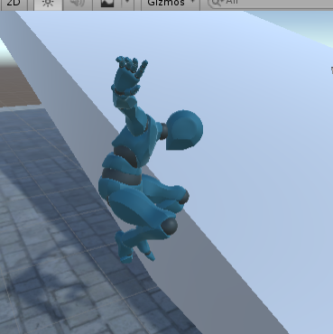
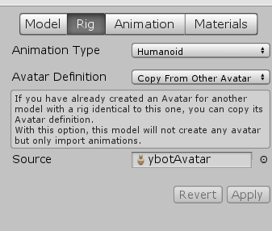
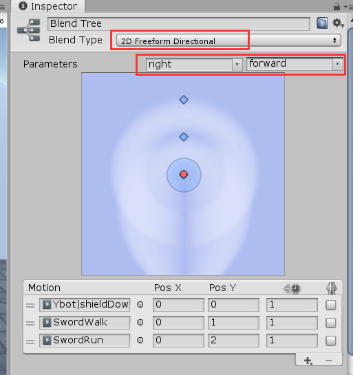
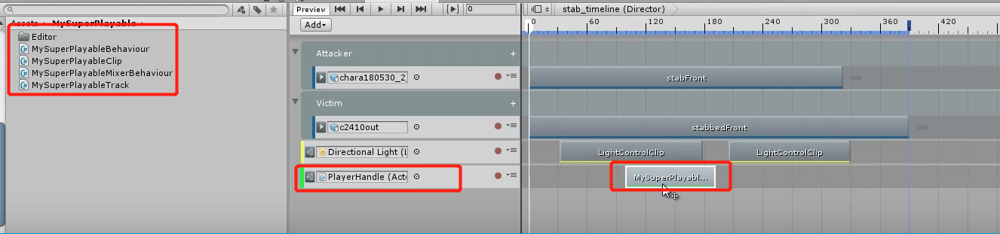
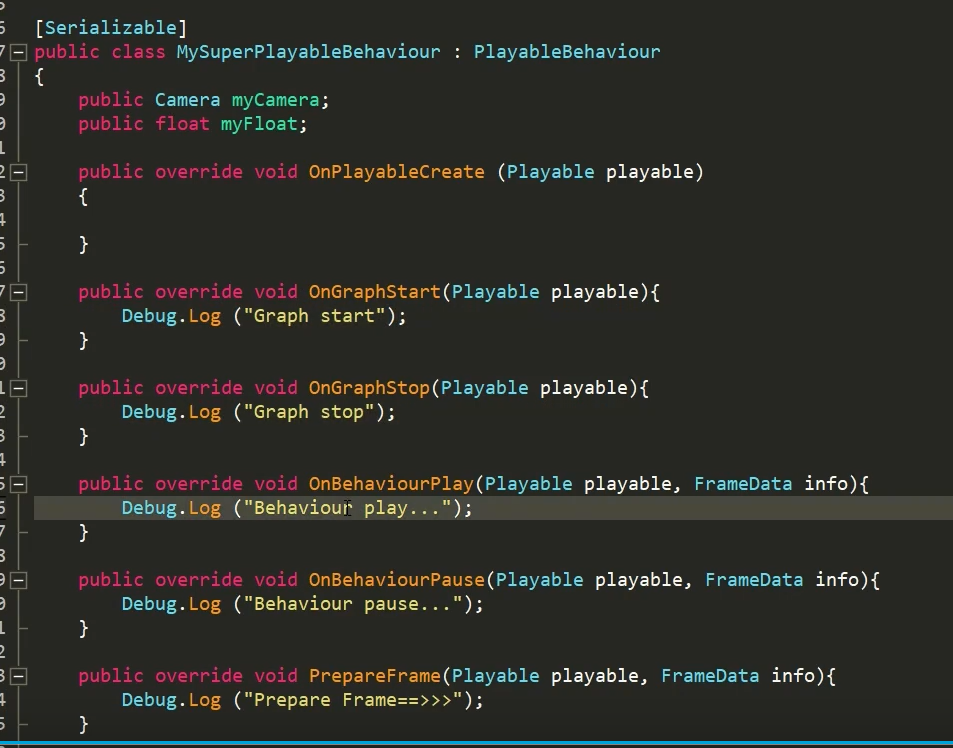

[toc]

# 1、用户输入模块

## 1、输入信号

将w和s的输入转化为-1到1的信号量，a和d也是。
再通过mathf.smoothDamp让信号量平滑过渡.

通过设置一个flag"inputEnable"来关闭输入.
```
public string keyUp = "w";
    public string keyDown = "s";
    public string keyLeft = "a";
    public string keyRight = "d";

    public float Dup;
    public float Dright;

    public bool inputEnable = true;

    private float targetDup;
    private float targetDright;
    private float velocityDup;
    private float velocityDright;

    void Update()
    {

        //关闭输入
        if(inputEnable)
        {
            //将wasd输入转化微signal。
            targetDup = (Input.GetKey(keyUp) ? 1.0f : 0) - (Input.GetKey(keyDown) ? 1.0f : 0);
            targetDright = (Input.GetKey(keyRight) ? 1.0f : 0) - (Input.GetKey(keyLeft) ? 1.0f : 0);
        }

        //通过smoothDamp让singal平滑过渡
        Dup = Mathf.SmoothDamp(Dup, targetDup, ref velocityDup, 0.1f);
        Dright = Mathf.SmoothDamp(Dright, targetDright, ref velocityDright, 0.1f);
    }
```

## 2、动画控制器

### 1、animatorController
新建一个animatorController，将其放入角色的animator组件中。


将需要的动画拖入animController中。

### 2、混合树

[混合树的使用](https://docs.unity3d.com/cn/2019.4/Manual/class-BlendTree.html)

混合树(Blend Tree)：用于允许通过按不同程度组合所有动画的各个部分来平滑混合多个动画。各个运动参与形成最终效果的量使用混合参数进行控制，该参数只是与动画器控制器关联的数值动画参数之一。

要使混合运动有意义，混合的运动必须具有相似性质和时间。混合树是动画器控制器中的特殊状态类型。

**混合树可以让不同动画之间进行混合，让切换平滑过渡。切换动画的时候不会显得僵硬。**


1、创建一个名叫ground的混合树，所有和踩在地面相关的都放在里面。


2、双击混合树，在混合树的inspector中添加motion。


第一个红圈表示动画播放速度，第二个是镜像

### 3.串连玩家控制与角色动画

**各种getComponent操作最好放在awake函数中，因为在start阶段都要开始操作别人身上的组件了，所以最好是大家约好在awake中把所有需要的组件抓好，那么在start阶段彼此交互就不会缺失某些组件**


```
public class actorController : MonoBehaviour
{
    public GameObject model;

    public PlayerInput pi;
    [SerializeField]
    private Animator anim;
    // Start is called before the first frame update
    void Awake()
    {
        pi = GetComponent<PlayerInput>();
        anim = model.GetComponent<Animator>();
    }

    // Update is called once per frame
    void Update()
    {
        anim.SetFloat("forward", pi.Dup);
    }
}
```

## 3.角色行走


**再利用transform.forward 和 trasnform.right 来旋转角色。通过变换角色本地坐标系中的z，来让角色旋转**。

Dmag 是 Dup 和 Dright 各自的平方相加，再开方,用来控制角色的移动动画与行走速度。

forwardDirection = Dup * transform.forward + Dright * transform.right;


```
public class PlayerInput : MonoBehaviour
{
    //Dup和Dright各自的平方相加，再开方,用来控制角色的移动动画与行走速度。
    private float Dmag;
    //改变角色的朝向，用来旋转juese
    private Vector3 forwardDirection;
    void Update()
    {
        Dmag = Mathf.Sqrt(Dup * Dup + Dright * Dright);
        forwardDirection = Dup * transform.forward + Dright * transform.right;
    }
}

public class actorController : MonoBehaviour
{
    public GameObject model;

    public PlayerInput pi;
    [SerializeField]
    private Animator anim;

    // Update is called once per frame
    void Update()
    {
        //切换行走动画
        anim.SetFloat("forward", pi.Dmag);
        //旋转角色模型。当Dup和Dright都为0，就不旋转角色了，否则会把0赋值给forward
        if(pi.Dmag > 0.1f)
        {
            model.transform.forward = pi.forwardDirection;
        }

    }
}
```

#### 让角色真正移动

**方案1： 利用Rigidbody组件**。rigidbody不太好控制。rigidbody想爬楼梯会很累，需要自己写代码，要判断这个楼梯是多高，先试踩一脚，如果发现可以踩，那就把坐标往上，推诸如此类逻辑。但rigidbody爬坡会比较好做。


**方案2： 利用CharacterController组件**。这是unity自己制作的，它的运算比较快。如果需要有重力的效果，需要明白move函数和simpleMove函数的区别。
如果要旋转重力的方向，那么characterController可以很快地利用simpleMove搭配另外方向的重力。
它比较好的地方是可以很容易地爬楼梯。

**这里采用rigidbody**


给角色添加rigidbody组件，再Freeze Rotation x、y、z轴。

**第一种方法：在fixedUpdate中更改rigidBody的position。**
```
public class actorController : MonoBehaviour
{
    public float walkSpeed = 2.0f;
    //角色位移量
    private Vector3 movingVec;

    void Update()
    {
        movingVec = pi.Dmag * model.transform.forward * walkSpeed;
    }
    private void FixedUpdate()
    {
        //位移 = 速度 * 时间
        rigid.position += movingVec * Time.fixedDeltaTime;
    }
}
```
**第二种方法：更改rigidbody的velocity**

需要注意的是：
```
        //直接指派速度，不需要乘时间
        rigid.velocity = movingVec;
```
与
```
        //位移 = 速度 * 时间
        rigid.position += movingVec * Time.fixedDeltaTime;
```
是等价的。但velocity不需要乘时间。

**但此时velocity是有问题的，** 因为movingVec是由forward值乘出来的，所以y分量为0。如果直接将movingVec赋给velocity，就会把原来rigidbody的y分量的值给覆写了。这样就不会有地心引力，而且也跳不起来。

**所以正确的写法是：**
```
rigid.velocity = new Vector3(movingVec.x, rigid.velocity.y, movingVec.z);
```

**做完这些后都要做爬楼梯或爬坡的测试。**

#### 还存在的问题： 

1.当角色斜45度角走时，速度会变快，这是因为Dmag的值此时变成了根号2，而不是1。

2.在斜坡上时，角色的脚掌还不能很好地踩地。这地方要通过逐步IK的设置。

## 4.跑步功能

将跑步动画添加进混合树中，设置Threshold为2.


playerInput代码中新加一个string变量KeyRun用来存储奔跑键，bool变量run标识奔跑键是否被按下。
run = Input.GetKey(keyRun);

然后在actorController中控制角色奔跑动画与速度。
```
public class actorController : MonoBehaviour
{
    //控制奔跑速度
    public float runMultiplier = 2.0f;

    void Update()
    {
        //在后面乘上
        anim.SetFloat("forward", pi.Dmag * (pi.run? 2.0f : 1.0f));
        
        //角色移动速度
        movingVec = pi.Dmag * model.transform.forward * walkSpeed * (pi.run ? runMultiplier : 1.0f);
    }
```

## 5.线性插值和球形线性插值（lerp和slerp）

Vector3.Lerp是在两个点之间进行线性插值。

Vector.slerp是在两个向量之间进行线性插值，返回的向量的方向通过角度进行插值

**通过使用Slerp让角色的转身不会转得过快。**

下面修改角色转身代码：
```
model.transform.forward = Vector3.Slerp(model.transform.forward, pi.forwardDirection, 0.3f);
```

**通过使用Mathf.lerp让角色从行走切换到跑步的动画不要太突兀。**
```
    float targetRunMulti = pi.run ? 2.0f : 1.0f;
    anim.SetFloat("forward", pi.Dmag * Mathf.Lerp(anim.GetFloat("forward"),targetRunMulti,0.5f));
```

## 6.椭圆映射法

[论文地址](https://arxiv.org/ftp/arxiv/papers/1509/1509.06344.pdf)

 前面遗留的问题，当让角色斜向运动时，运动速度会变快。这是因为以Dup和Dright为直角边的三角形的斜边为根号2，不是1。

 此时可以通过椭圆映射法将正方形的坐标映射到圆的坐标上，当Dup和Dright同时为1时，通过映射后，得到的斜边值为1。


修改代码

```

void Update()
{
    //将水平输入和垂直输入映射到圆上
        Vector2 tempDAxis = sphereToCircle(new Vector2(Dright, Dup));
        float newDup = tempDAxis.y;
        float newDright = tempDAxis.x;

        Dmag = Mathf.Sqrt(newDup * newDup + newDright * newDright);
        forwardDirection = newDup * transform.forward + newDright * transform.right;
}
private Vector2 sphereToCircle(Vector2 input)
    {
        Vector2 output = Vector2.zero;

        output.x = input.x * Mathf.Sqrt(1 - (input.y * input.y) / 2);
        output.y = input.y * Mathf.Sqrt(1 - (input.x * input.x) / 2);

        return output;
    }
```

## 7.跳跃

### 1.信号输入

```
//trigger once signal
    public bool jump;
    private bool lastJump;
void jumpEvent()
    {
        bool newJump = Input.GetKeyDown(keyJump);
        //后面还要判断newJump为true，是防止newJump为false，但lastJump为true时，也触发jump。
        if (newJump != lastJump && newJump == true)
        {
            jump = true;
            print("jump trigger");
        }
        else
        {
            jump = false;
        }
        lastJump = newJump;
    }
```
添加动画，一个trigger类型变量jump

切换动画
在actorController的update中
```
 if(pi.jump)
        {
            anim.SetTrigger("jump");
        }
```
### 2.重置triiger

但连续点击跳跃时，会导致unity累计两次Trigger，导致多一次跳跃。

**解决 1：**

**在动画状态机ground中，添加一个脚本，该脚本会自动继承自StateMachineBehaviour。**

在OnStateEnter函数中，遍历要清空的signal，调用animator的resetTrigger函数来进行清空。

```
public class FSMClearSignals : StateMachineBehaviour
{
    public string[] clearAtEnter;
    public string[] clearAtExit;

    // OnStateEnter is called when a transition starts and the state machine starts to evaluate this state
    override public void OnStateEnter(Animator animator, AnimatorStateInfo stateInfo, int layerIndex)
    {
        foreach (var signal in clearAtEnter)
        {
            animator.ResetTrigger(signal);
        }
    }

    // OnStateExit is called when a transition ends and the state machine finishes evaluating this state
    override public void OnStateExit(Animator animator, AnimatorStateInfo stateInfo, int layerIndex)
    {
        foreach (var signal in clearAtExit)
        {
            animator.ResetTrigger(signal);
        }
    }

```

**解决2：**
在actorController中添加一个参数，热键输入就++，大于2时就不setTrigger，动画播放完毕后再把该参数置为0.

### 3.跳跃时禁止输入

但角色跳跃时，禁止输入移动信号。

在状态机中jump状态下，添加两个脚本onJumpEnter，onJumpExit。通过在这两个脚本中往外发送消息的方式，来控制输入信号的开关。

**不要在动画状态中塞入太多逻辑，否则以后dubug时很难找到这段逻辑到底在哪。所以这些脚本都应该是很简单的代码，不应该有太多逻辑在里面**


**优化点：sendMessageUpwards可以优化，它的效率并没有那么好**

```
public class onJumpEnter : StateMachineBehaviour
{
    public string[] onEnterMessages; 
    // OnStateEnter is called when a transition starts and the state machine starts to evaluate this state
    override public void OnStateEnter(Animator animator, AnimatorStateInfo stateInfo, int layerIndex)
    {
        foreach(var msg in onEnterMessages)
        {
            animator.gameObject.SendMessageUpwards(msg);
        }
    }
}

public class OnJumpExit : StateMachineBehaviour
{
    public string[] onExitMessages;

    // OnStateExit is called when a transition ends and the state machine finishes evaluating this state
    override public void OnStateExit(Animator animator, AnimatorStateInfo stateInfo, int layerIndex)
    {
        foreach(var msg in onExitMessages)
        {
            animator.gameObject.SendMessageUpwards(msg);
        }
    }
}

```


在actorController中接收消息。
**尽量不要把代码放到第二层，很容易忘记在哪**

```
     public void onJumpEnter()
    {
        pi.inputEnable = false;
    }
    public void onJumpExit()
    {
        pi.inputEnable = true;
    }
```
### 4.跳跃冲量

在actorController中新增变量
```
    //跳跃垂直速度
    public float jumpVelocity = 3.0f;
    //跳跃冲量
    private Vector3 thrustVec;
```
在角色的velocity中加上跳跃冲量，然后立刻将冲量置为0。在onJumpenter中给冲量赋值。
```
    private void FixedUpdate()
    {
        //rigid.position += planarVec * Time.fixedDeltaTime;
        //直接指派速度，不需要乘时间,后面加上个跳跃的冲量，加完后冲量立刻置为0
        rigid.velocity = new Vector3(planarVec.x, rigid.velocity.y, planarVec.z) + thrustVec;
        thrustVec = Vector3.zero;
    }

    public void onJumpEnter()
    {
        pi.inputEnable = false;
        thrustVec = new Vector3(0, jumpVelocity, 0);
    }
```

## 8.降落动画

### 添加降落动画

### 新增地面侦测器

新增一个空物体命名为sensor，用来存放各种传感器。

新增一个OnGroundSensor，通过Physics.OverlapCapsule函数来检测角色是否碰撞到地面。


一个Capsule是由两个圆组成的，所以函数参数分别需要两个圆的圆心、半径。**同时给两个圆添加一些偏移量，使得他们组成的capsule整体往下沉，且不与角色的capsuleColiider大小完全，否则会出现结果与预期不符的现象。**


```
public class OnGroundSensor : MonoBehaviour
{
    public CapsuleCollider capCol;
    private Vector3 point0;
    private Vector3 point1;
    private float radius;
    public float offset = 0.1f;
    // Start is called before the first frame update
    void Awake()
    {
        radius = capCol.radius - 0.05f ;
    }

    // Update is called once per frame
    void FixedUpdate()
    {
        point0 = transform.position + transform.up * (radius - offset) ;
        point1 = transform.position + transform.up * (capCol.height - radius - offset);

        Collider[] outputCol = Physics.OverlapCapsule(point0, point1, radius, LayerMask.GetMask("Ground"));
        if (outputCol.Length != 0)
        {
            print("isGround");
            SendMessageUpwards("IsGround");
        }
        else
        {
            print("isNotGround");
            SendMessageUpwards("IsNotGround");
        }
    }
}
```
**化点：sendMessageUpwards**

切换动画：animatorController新增一个bool变量，isGround，jump到ground和fall到ground的过渡条件都是isGround为true

```
public class actorController : MonoBehaviour
{
    public void IsGround()
    {
        anim.SetBool("isGround", true);
    }

    public void IsNotGround()
    {
        anim.SetBool("isGround", false);
    }
```


### 修改Bug

#### 1、
角色直挺挺地下落，添加一个bool变量，当角色下落时，锁死角色水平速度。给fall状态添加一个FSMOnEnter脚本，发送消息。

```
public class actorController : MonoBehaviour
{   
     //锁定水平移动速度
    private bool lockPlanar = false;

    void Update()
    {
        //修改角色移动速度
        if(!lockPlanar)
        {
            planarVec = pi.Dmag * model.transform.forward * walkSpeed * (pi.run ? runMultiplier : 1.0f);
        }
    }
    public void OnFallEnter()
    {
        //当掉落时，锁定水平速度，以抛物线下落，以免直直地下落
        lockPlanar = true;
    }
}
```

#### 2、
此时角色的跳跃动画到降落动画的过渡只有Exit time，这表示当跳跃动画播放到一定百分比时，就会满足过渡条件，自动过渡到降落动画。

如果在过渡期间接触到地面，就会看到角色明明已经接触到地面了，却还要播一小段降落动画。

解决方法：让jump->fall的过渡可以被打断，设置interruption source选择，选择current state，表示可以被jump状态的其它过渡打断，勾选了下面的Orderd Interrupt表示只能被比jump->fall的优先级高的过渡打断。


这样当角色接触地面时，下降动画就能被打断了。

#### 3、
当角色降落期间撞到墙壁，就会卡在空中，一直下不来。


这是因为角色的velocity和摩擦力，在降落时锁死了velocity，导致velocity一直有一个向前的力，让摩擦力非常大，掉不下来。

解决思路：但角色在空中时，切换角色的物理材质为零摩擦力物理材质，回到地面时再切回来。
## 9.翻滚动画

修改翻滚动画的animation中Root TransForm Position选项，勾选下面的Bake onto pose，让角色的根结点在垂直方向上跟随角色移动。

黑魂中，人物行走时，按下跳跃键就会翻滚。当奔跑时，才是跳跃再接着翻滚。


对于ground->jump就不用去设置forward大于0了，可以通过各个过渡进行排序达到正确切换动画。


跳跃到翻滚也要连一条过渡。

### 增加向后的速度

当向后跳跃时，给角色增加一个向后的速度。

**利用动画曲线来控制向后速度的衰减。**


在动画控制器新增一个jabVelocityRate变量来控制速度衰减。在后跳动画中添加曲线来控制该变量。


代码：在后跳动画的运行期间都调用OnJabUpdate
```
 private void FixedUpdate()
    {

        rigid.velocity = new Vector3(planarVec.x, rigid.velocity.y, planarVec.z) + thrustVec + jabThrust;
        thrustVec = Vector3.zero;
    }
 public void OnJabUpdate()
    {
        //向后的冲量
        jabThrust = model.transform.forward * jabVelocity * anim.GetFloat("jabVelocityRate");
    }

```

# 2、摄像机

## 输入信号

键盘四个方向键
```
public class PlayerInput : MonoBehaviour
{
    public string keyJup;
    public string keyJdown;
    public string keyJright;
    public string keyJleft;

     //摄像头移动方向
    public float Jup;
    public float Jright;

    void Update()
    {
        Jup = (Input.GetKey(keyJup) ? 1.0f : 0) - (Input.GetKey(keyJdown) ? 1.0f : 0);
        Jright = (Input.GetKey(keyJright) ? 1.0f : 0) - (Input.GetKey(keyJleft) ? 1.0f : 0);
```

## 相机旋转

**用playerHandler来控制摄像机的水平旋转，用playerHandler底下一个子物体cameraHandle来控制摄像机的垂直旋转。**

在playerHandler下创建一个子物体CameraHandler，将CameraHandler放在角色的脖子位置，再将摄像机放在CameraHandler底下。


**给摄像机新增加一个脚本CameraController**

```
public class CameraController : MonoBehaviour
{
    //信号输入
    public PlayerInput pi;
    //相机水平旋转速度
    public float horizontalSpeed = 20.0f;
    public float verticalSpeed = 80.0f;

    //控制相机水平旋转
    private GameObject playerHandler;
    //控制相机垂直旋转
    private GameObject cameraHandler;
    public float currentVerticalAngle;

    // Start is called before the first frame update
    void Awake()
    {
        cameraHandler = transform.parent.gameObject;
        playerHandler = cameraHandler.transform.parent.gameObject;
        currentVerticalAngle = 0;
    }

    // Update is called once per frame
    void Update()
    {
        //相机水平旋转
        playerHandler.transform.Rotate(Vector3.up, pi.Jright * horizontalSpeed * Time.deltaTime);

        //相机垂直旋转
        currentVerticalAngle += pi.Jup * -verticalSpeed * Time.deltaTime;
        currentVerticalAngle = Mathf.Clamp(currentVerticalAngle, -40, 30);
        cameraHandler.transform.localEulerAngles = new Vector3(currentVerticalAngle,0,0);

    }
}
```

注意：垂直旋转需要限定旋转角度在-40到30之间。如果使用rotate方法旋转，然后再读取eulerAngle的x值来限定范围。**这种做法是错误的**，因为从aulerAngle读出来的值可能与分配的值截然不同。


官方文档中写着：


所以不能通过rotate来实现。

所以正确做法是：
```
public float currentVerticalAngle;
        //相机垂直旋转
        currentVerticalAngle += pi.Jup * -verticalSpeed * Time.deltaTime;
        currentVerticalAngle = Mathf.Clamp(currentVerticalAngle, -40, 30);
        cameraHandler.transform.localEulerAngles = new Vector3(currentVerticalAngle,0,0);

```

**通过设置localEulerAngles的值来改变角度，不依赖从eulerAngles当中读取角度。** 这里需要用localEulerAngles，不然用eulerAngle的话，y和z的值会覆盖相机的水平旋转。

## 相机延迟移动

为了让相机旋转时，角色模型保持不动，需要在相机旋转前保存模型当前的旋转，相机旋转后，再把模型的旋转设置为原来的角度。

这时就体现出了用PlayerHandler来控制相机的水平旋转的好处了，**因为相机的forward方向永远与PlayerHandler一样，** 而角色模型的前方朝向是依据PlayerHandler的forward来旋转。这样就导致相机旋转后，角色一旦向前走，就会转向相机的forward方向。


延迟移动：
**用一个空物体代替mainCamera的位置，让camera追这个物体。** cameraController代码放在这个空物体中。


```
public float cameraSmoothTime = 0.05f;
private Vector3 cameraDampVelocity;
private GameObject mainCamera;

private void FixedUpdate()
    {
        // 让摄像机平滑地追上角色
        mainCamera.transform.position = Vector3.SmoothDamp(mainCamera.transform.position, transform.position,
            ref cameraDampVelocity, cameraSmoothTime);
        mainCamera.transform.eulerAngles = transform.eulerAngles;
    }
```

## 隐藏鼠标icon

利用[Cursor](https://docs.unity3d.com/cn/2019.4/ScriptReference/Cursor.html)类,设置光标（鼠标指针）的光标 API。

在cameraController中
```
void Awake()
    {
        //开始运行游戏就隐藏鼠标光标
        Cursor.lockState = CursorLockMode.Locked;
    }
```

# 优化1

## 封装信号

将trigger once 类型信号封装成一个类，如jump、attack，减少重复代码。

```
public class ButtonInput 
{
    public bool isPressing = false;
    //刚刚按下
    public bool onPressed = false;
    //刚刚释放
    public bool onReleased = false;

    private bool currenState = false;
    private bool lastState = false;

    public void Tick(bool input)
    {
        currenState = input;

        isPressing = currenState;

        onPressed = false;
        onReleased = false;
        if(currenState != lastState)
        {
            if(currenState == true)
                onPressed = true;
            else
                onReleased = true;
        }

        lastState = currenState;
    }
}
```

# 计时器类

## 实现

```
public class ButtonTimer 
{
    //计时器当前的状态
    public enum STATE
    {
        FINISHED,
        RUN
    }
    public STATE state;

    //计时上限
    public float duration = 1.0f;
    //已持续的时间
    private float elapsedTime = 0;

    public void Tick(float deltaTime)
    {
        //开始计时
        if(state == STATE.RUN)
        {
            elapsedTime += Time.deltaTime;
            if (elapsedTime >= duration)
                state = STATE.FINISHED;
        }
    }

    //启动计时器
    public void GO()
    {
        elapsedTime = 0;
        state = STATE.RUN;
    }
}
```

## 双击功能

黑魂中的双击功能，延长的时间是**从上一次按键被释放开始计时**，这样就造成长按某个键，再释放并快速地按第二次，也能形成双击效果。

正常游戏中的双击是**从上一次按键被按下开始计时**，这样就避免了上面的问题。

下面给出的是正常版本，在下一节中的长按功能中一起给出黑魂版本。

利用计数器实现double trigger
```
public class ButtonInput 
{
    //计时上限
    public float extendingDuration = 0.3f;

    //是否处于延长时间内,用来判断double trigger
    public bool isExtending = false;

    //延长时间的计时器，用来实现double trigger
    private ButtonTimer extTimer = new ButtonTimer();

    //累计的按下按键的次数，用来判断double trigger
    public int accumulatedCount = 0;
    //是否触发double trigger
    public bool doublePressed = false;

    public void Tick(bool input)
    {
        extTimer.Tick(Time.deltaTime);

        currenState = input;

        isPressing = currenState;

        onPressed = false;
        onReleased = false;

        if (currenState != lastState)
        {
            if(currenState == true)
            {
                onPressed = true;
                //增加累计数
                accumulatedCount++;
                //从按下按键那一刻开始计时，如果正在计时中，就不要重新开启计时器
                if(!isExtending)
                    StartTimer(extTimer, extendingDuration);
            }
            else
            {
                onReleased = true;
            }
        }
        lastState = currenState;
        
        //判断是否处于延长时间
        isExtending = (extTimer.state == ButtonTimer.STATE.RUN);
        //判断是否在延长时间内连续按两次
        doublePressed = false;
        if (!isExtending)
        {
            doublePressed = false;
            accumulatedCount = 0;
        }
        else if(accumulatedCount == 2)
        {
            doublePressed = true;
            accumulatedCount = 0;
        }
    }
```

## 长按功能

由于黑魂的游戏机制比较特殊，所以顺带修改一下ButtonInput类，双击功能分为黑魂版和正常版。

```
public class ButtonInput 
{
    public bool isPressing = false;
    //刚刚按下
    public bool onPressed = false;
    //刚刚释放
    public bool onReleased = false;
   
    private bool currenState = false;
    private bool lastState = false;

    //======================== 双击功能 ================================
    //     ============== 黑魂版 ======================
    //是否处于连按延长时间内,用来判断double trigger
    public bool isExtending = false;
    //计时上限
    public float extendingDuration = 0.15f;
    //连按延长时间的计时器，用来实现double trigger
    private ButtonTimer extTimer = new ButtonTimer();


    //     ============== 正常版（额外加上以下变量） ======================
    //累计的连续按下按键的次数，用来判断double trigger
    //public int accumulatedCount = 0;
    //public bool doublePressed = false;


    //======================== 长按功能 ===================================
    //实现长按功能
    public bool isDelaying = false;
    public float delayingDuration = 0.15f;
    private ButtonTimer delayTimer = new ButtonTimer();


    public void Tick(bool input)
    {
        extTimer.Tick();
        delayTimer.Tick();

        currenState = input;

        isPressing = currenState;

        onPressed = false;
        onReleased = false;
        isDelaying = false;
        if (currenState != lastState)
        {
            if(currenState == true)
            {
                onPressed = true;

                //====================== 长按功能 ========================
                StartTimer(delayTimer, delayingDuration);

                //====================== 双击功能 ========================
                //      ============ 正常版 ===============
                //增加累计数
                //accumulatedCount++;
                ////从按下按键那一刻开始计时，如果正在计时中，就不要重新开启计时器
                //if(!isExtending)
                //    StartTimer(extTimer, extendingDuration);
            }
            else
            {
                onReleased = true;
                //====================== 双击功能 ========================
                //      ============ 黑魂版 ===============
                StartTimer(extTimer, extendingDuration);
            }
        }
        lastState = currenState;

        //====================== 长按功能 ========================
        if (delayTimer.state == ButtonTimer.STATE.RUN)
        {
            isDelaying = true;
        }

        //========================== 双击功能 =============================

        //    ================== 黑魂版 ========================
        //判断是否处于连按延长时间
        isExtending = (extTimer.state == ButtonTimer.STATE.RUN);

        //    ================== 正常版（额外加上以下代码） ================
        //判断是否在连按延长时间内连续按两次
        //doublePressed = false;
        //if (!isExtending)
        //{
        //    doublePressed = false;
        //    accumulatedCount = 0;
        //}
        //else if(accumulatedCount == 2)
        //{
        //    doublePressed = true;
        //    accumulatedCount = 0;
        //}
    }

    public void StartTimer(ButtonTimer timer, float duration)
    {
        timer.duration = duration;
        timer.GO();
    }
}


```

在keyboardInput中修改各类信号的输入。

keyboard是由前面的playerInput改名的，将一些会和手柄输入的代码抽象出来放在父类IUserInput中。
```
void Update()
    {
        //更新各类按钮的状态，这些对象在父类中IUserInput实例化了
        ButtonJump.Tick(Input.GetKey(keyJump));
        ButtonAttack.Tick(Input.GetKey(keyAttack));
        ButtonRun.Tick(Input.GetKey(keyRun));
  

        //run = Input.GetKey(keyRun);
        //run信号为长按,黑魂中run是长按才会触发的
        run = (ButtonRun.isPressing && !ButtonRun.isDelaying) || ButtonRun.isExtending;
        //在奔跑过程中再按一次奔跑键才能跳跃
        jump = ButtonJump.onPressed && ButtonRun.isPressing;
        //按下奔跑键立马释放就后跳，如果此时还按着方向键就向前翻滚，方向键在状态机中判断
        roll = ButtonRun.onReleased && ButtonRun.isDelaying;
    }
```

# 战斗系统
## 1、动画

新建攻击[动画层](https://docs.unity3d.com/cn/2019.4/Manual/AnimationLayers.html)，添加攻击动画。


需要设置该[动画层](https://docs.unity3d.com/cn/2019.4/Manual/AnimationLayers.html)的权重，才会覆盖上一层。


### [Avatar Mask](https://docs.unity3d.com/cn/2019.4/Manual/class-AvatarMask.html)

Mask用于指定此层上使用的遮罩，也就是要取出那几根骨头来影响上一层。
例如只想播放模型上半身的投掷动画，同时让角色也能够行走或跑动，则可以在层上使用一个遮罩，从而在定义上半身部分的位置播放投掷动画。

### 修改动画层的权重

```

    public void OnAttack1hEnter()
    {
        pi.inputEnable = false;
        anim.SetLayerWeight(anim.GetLayerIndex("attack"), 1.0f);
    }

    public void OnIdleEnter()
    {
        pi.inputEnable = true;
        anim.SetLayerWeight(anim.GetLayerIndex("attack"), 0);
    }
```

### 限制攻击条件

运用动画的api：anim.GetCurrentAnimatorStateInfo。

当跳起来和降落到地面时就修改canAttack参数。

```
private bool canAttack;
   void Update()
    {
//攻击，后面限制攻击条件
        if (pi.attack && checkState("ground") && canAttack)
        {
            anim.SetTrigger("attack");
        }
    }
//查看当前动画层所处的状态是否与stateName一致
    public bool checkState(string stateName, string layerName = "Base Layer")
    {
        return anim.GetCurrentAnimatorStateInfo(anim.GetLayerIndex(layerName)).IsName(stateName);
    }
```

### 添加连击动画


修改新动画的Rig下面的animation type和avatar。



勾选animation下面的各种烘培。


### 设置连击timing

利用动画事件，在一段攻击播放到特定时间时，清空attack Trigger，迫使玩家在后面按攻击键才会触发连击。

给juese模型新添加一个脚本AnimTriggerController

```
public class AnimTriggerController : MonoBehaviour
{
    private Animator anim;

    private void Awake()
    {
        anim = GetComponent<Animator>();
    }

    public void ResetTrigger(string triggerName)
    {
        anim.ResetTrigger(triggerName);
   
```

给各段攻击动画添加事件


### 获取动画的Root Motion

在一些动画中角色是会移动的，这时就需要在动画播放过程中控制角色也进行相应的移动。

MonoBehaviour.OnAnimatorMove()可以解决这个问题，


```
public class RootMotionController : MonoBehaviour
{
    private Animator anim;
    private void Awake()
    {
        anim = GetComponent<Animator>();
    }
    private void OnAnimatorMove()
    {
        SendMessageUpwards("OnUpdateRM", (object)anim.deltaPosition);
    }
}
```


当OnAnimationMove函数被用了之后，animator中的Apply Root Motion就不能勾选了。


最后在actorController中修改rigid.position。
```
//动画每帧的根运动
    private Vector3 deltaPos;

    private void FixedUpdate()
    {
        //叠加动画的根运动。
        rigid.position += deltaPos;
        deltaPos = Vector3.zero;
    }
 //更新动画的根运动
    public void  OnUpdateRM(object _deltaPos)
    {
        if(checkState("attack1hC", "attack"))
        {
            deltaPos = (Vector3)_deltaPos;
        }
    }
```

### 动画水平翻转

通过勾选状态的mirror属性来翻转动画。勾选后，右手攻击就变成了左手攻击。


勾选mirror右边的parameter，使用状态机参数来控制mirror。


### 摄像头抖动修正

1、摄像机的旋转用lookAt
```
mainCamera.transform.LookAt(cameraHandler.transform);
```

2、如果运用了根运动，就修改animator组件的Update Mode为Animate Physics。


3、此时第三段连击时还是会有轻微的晃动，这是因为在第三段连击时应用了根运动。但如果以权重的方式修正抖动的话，又会导致这个动作踏不出去。
```
//更新动画的根运动
    public void  OnUpdateRM(object _deltaPos)
    {
        if(checkState("attack1hC", "attack"))
        {
            //后面乘以权重的目的是修正摄像机抖动
            deltaPos = deltaPos * 0.8f + 0.2f * (Vector3)_deltaPos;
        }
    }
```

### 通过OnAnimatorIK修改动画

目前当角色闲置时，角色还是举着盾牌，我们希望他把盾牌放下。因为没有美术人员，所以自己通过代码稍微修改一下动画。


**利用MonoBehaviour.OnAnimatorIK(int)实现。**

**需要注意的是：一个动画层勾选了IK Pass，引擎才会去呼叫OnAnimatorIK，不然OnAnimatorIK函数不起作用。**


调用OnAnimatorIK的脚本需要放在animator组件的兄弟层。

```
public class leftArmAnimFix : MonoBehaviour
{
    private Animator anim;
    public Vector3 leftLowerArmRotation;

    private void Awake()
    {
        anim = GetComponent<Animator>();
    }

    private void OnAnimatorIK(int layerIndex)
    {
        Transform leftLowerArm = anim.GetBoneTransform(HumanBodyBones.LeftLowerArm);
        leftLowerArm.localEulerAngles += leftLowerArmRotation;
        anim.SetBoneLocalRotation(HumanBodyBones.LeftLowerArm, Quaternion.Euler(leftLowerArm.localEulerAngles));
    }
}
```
修改后


### 盾牌动画

新添加盾牌动画，因为有了新的盾牌放下的动画了，所以OnAnimatorIK用不上了。

## 2、锁定功能

### 1、overlapBox

新增LockOn按钮和信号，在cameraControllor中控制改变锁定的状态。

当按下LockOn按钮时，调用cameraController中changeLockOn函数去尝试锁定敌人或取消锁定。

```
public class CameraController : MonoBehaviour
{
    //被锁定的object
    private GameObject lockTarget;
    public bool lockOnState;

    //反转LockOn状态
    public void ChangeLockOn()
    {
        if(lockTarget == null)
        {
            //try to lock a object
        }
        else
        {
            //release locked object
        }
    }

```

利用**physics.overlapBox**来检测前方是否由敌人，实现锁定。

```
 //反转LockOn状态
    public void ChangeLockOn()
    {
        Vector3 modelOrigin = model.transform.position + new Vector3(0, 1, 0);

        //因为用的是playerHandler的正前方为中心，所以永远在摄像机的正前方锁定敌人。
        Vector3 boxCenter = modelOrigin + playerHandler.transform.forward * 5.0f;

        Collider[] cols = Physics.OverlapBox(boxCenter, new Vector3(0.5f, 0.5f, 5.0f)
            , playerHandler.transform.rotation,LayerMask.GetMask("Enemy"));

        if(cols.Length > 0)
        {
            //如果连续对同一个物体按两次lockOn，就会取消锁定，否则锁定该物体
            if(lockTarget != cols[0].gameObject)
            {
                lockTarget = cols[0].gameObject;
                lockOnState = true;
            }
            else
            {
                lockTarget = null;
                lockOnState = false;
            } 
        }
        else
        {
            lockTarget = null;
            lockOnState = false;
        }
    }
```

在锁定敌人后，也将摄像机的水平旋转锁定。
修改cameraController代码

```
private void FixedUpdate()
    {
        //没有锁定敌人时，才可以自由旋转相机，否则摄像机一直看向敌人
        if(lockTarget == null)
        {
            //保存模型当前旋转角度，确保相机旋转时，角色模型不动
            currentModelEuler = model.transform.eulerAngles;
            //相机水平旋转
            playerHandler.transform.Rotate(Vector3.up, pi.Jright);

            //相机垂直旋转
            currentVerticalAngle += -pi.Jup;
            currentVerticalAngle = Mathf.Clamp(currentVerticalAngle, -40, 30);
            cameraHandler.transform.localEulerAngles = new Vector3(currentVerticalAngle, 0, 0);

            //确保相机旋转时，角色模型不动
            model.transform.eulerAngles = currentModelEuler;
        }
        else
        {
            Vector3 tempForward = lockTarget.transform.position - model.transform.position;
            tempForward.y = 0;
            playerHandler.transform.forward = tempForward;
        }
```

### 2、2D混合树

有了锁定功能后，由于还没有左右走的动画，当锁定敌人时，一直面朝敌人移动就会出错。所以现在要添加新的左右走动画，并更改ground状态的混合树为2D Freedom Direction，并新增一个right参数。



再完善斜向走和跑。


### 3、角色的移动

 修改角色的正前方与移动速度。新增一个bool变量trackDirection，用来判断是否在锁定期间进行跳跃或翻滚。
 ```
 //处于锁定敌人的状态与不锁定时移动方式不同
        if(cameraCtr.lockOnState == false)
        {
            //将原理正常状态时的移动代码放入这里。
        }
        else
        {
            //角色要时刻面向被锁定的敌人,模型的前方为playerController的前方（指向敌人）。
            //除非角色在此期间进行跳跃或翻滚，就不让模型指向敌人了。
            if (trackDirection == false)
            {
                model.transform.forward = transform.forward;
            }
            else
            {
                model.transform.forward = planarVec.normalized;
            }

            if (!lockPlanar)
            { 
                //此时移动的输入要分为两个轴了，所以不能用Dmag，而是forwardDirection
                planarVec = pi.forwardDirection * walkSpeed * (pi.run ? runMultiplier : 1.0f);
            }
        }
 ```

 修改移动动画信号输入

```
//锁定与未锁定状态的移动动画
        if(cameraCtr.lockOnState == false)
        {
            if (pi.Dmag > 0)
            {
                //切换角色行走动画，并且通过lerp让行走与奔跑之间有个平滑的过渡。
                anim.SetFloat("forward", pi.Dmag * Mathf.Lerp(anim.GetFloat("forward"), (pi.run ? 2.0f : 1.0f), 0.5f));
                anim.SetFloat("right", 0);
            }
        }
        else
        {
            anim.SetFloat("forward", pi.Dup * (pi.run ? 2.0f : 1.0f));
            anim.SetFloat("right", pi.Dright * (pi.run ? 2.0f : 1.0f));
        }
```

### 4、完善锁定UI

在CameraController中修改代码

首先将敌人的模型也放在一个空的EnemyHandler底下，这个空的EnemyHandler的原点在模型脚底的位置。collider也从敌人模型中转到这个EnemyHandler。

因为要计算enemyHandler的中央位置，所以需要知道collider的半高。干脆把被锁定的敌人和敌人的半高封装成一个内部类

将lockTarget封装成一个内部类
```
public class LockTarget
    {
        public GameObject obj;
        public float halfHeight;

        public LockTarget(GameObject _obj, float _halfHeight)
        {
            obj = _obj;
            halfHeight = _halfHeight;
        }
    }
```

修改锁定UI的位置，利用**camera.worldToScreenPoint**
```
 private void FixedUpdate()
    {
        //让锁定的图标一直在敌人的中央
        if(lockTarget != null)
        {
            lockIcon.rectTransform.position = Camera.main.WorldToScreenPoint(
                lockTarget.obj.transform.position + new Vector3(0, lockTarget.halfHeight, 0));
        }
    }
```

## 3、attack子状态机

在base layer里面，右键新建一个Sub-State-Machine，将原来attack动画层的内容复制进去。


删除了attack动画层后，actorController代码也要进行相应的修改，去除冗余代码。里面切换动画层权重的代码也不要了。

## 4、左右手攻击动画的分离

在attack子状态机中，copy右手攻击的动画，上面是右手攻击，下面是左手攻击。


勾选三个左手动画的mirror选项，用来镜像动画。


新增mirrorAttack参数，当mirrorAttack为false就播放右手攻击动画，否则播放左手攻击动画。

分别将右手和左手攻击动画的tag为attackR、attackL，这是为了能够在代码中判断右手和左手。


在黑魂中，装在左手上的东西，只有盾才能举.

将actorcontroller中attack信号，改为rightAttack和leftAttack信号，分别为左手攻击和右手攻击，再更改相应的代码得到基本的左右手攻击。

鼠标左键右手攻击，鼠标右键左手攻击。

## 5、敌人AI

先直接复制一个playerHandler来作为敌人。

修改cameraController代码，新加一个bool变量（isAI）。AI不可以控制main camera和锁定UI，通过判断isAI来修改变量。

新增一个EnemyAIIput脚本，用来控制AI的输入信号。
**Start函数也可以用来当协程使用。**
```
public class EnemyAIInput : IUserInput
{


    // Start is called before the first frame update
    IEnumerator Start()
    {
        rightAttack = true;
        yield return 0;
    }

    // Update is called once per frame
    void Update()
    {
        
    }
}

```

## 6、受击状态

在base layer动画层中新增受击动画，从Any State过渡到受击。


## 7、武器开关

利用动画事件来控制武器的collider的开关，让武器在被挥出去的某一段时间内collider才开启。

# Manager类

游戏中由ActorManager来作为中枢处理游戏逻辑，只有ActorManager知道角色与周边环境的关系与交互。比如如果有两个人的话，由他们两个人的ActorManager互相沟通。

而ActorManager下面又有很多其他类别的Manager，这些Manager检测到事件后交给ActorMangaer进行处理，判断是否要让角色做出相应的反应。


## Bettle Manager

新增一个Bettle Manager类，放在playerHandler底下，它需要一个新的capsuleCollirer用来做防御碰撞框。


调整它的layer为BettleManager，并修改物理碰撞矩阵，让Weapon层可以和BettleManager层碰撞。

## Actor Manager

新增一个Actor Manager类，放在playerHandler底下。

让ActorManager和BettleManager互相引用。ActorManager有actorController的引用。

**由bettleManager检测玩家是否被敌人武器砍到 ----> bettleManager呼叫ActorManager中的TryDoDemage函数 ----> ActorManager再呼叫ActorController中的IssueTrigger函数触发动画。**


## WeaponManager

新增WeaponManager类，用来控制武器的collider的开关。

WeaponManager下面会有两个WeaponHandle，之所以是两个是因为可以双持武器。WeaponHandle下面又会有WeaponDate。

## StateManager

Statemanager与ActorManager是双向持有的关系，StateManager复制存储角色的各种属性，它可以从外部文件读取角色数据，如生命值。

在StateManager中添加生命值等变量，**增加ChangeHP函数**，ActorManager的BeHit函数会尝试去调用该函数来修改生命值。

 

# 优化 ：全局消息中心

**建立一个全局的消息中心来处理各种动画状态的消息，代替unity自己的sendMessage。**

## 单例模型
用来控制消息中心只有一个全局的实例。

```
using System;
using System.Reflection;

public  abstract class SingleTon<T> where T : class
{
    private static T instance = null;

    //多线程安全机制
    private static readonly object locker = new object();

    public static T Instance
    {
        get
        {
            //线程锁
            lock (locker)
            {
                if (null == instance)
                {
                    //反射获得T的构造函数。
                    var octors = typeof(T).GetConstructors(BindingFlags.Instance | BindingFlags.NonPublic);
                    //获得T的无参构造函数
                    var octor = Array.Find(octors, c => c.GetParameters().Length == 0);

                    if (null == octor)
                    {
                        throw new Exception("No NonPublic constructor without 0 parameter");
                    }

                    instance = octor.Invoke(null) as T;
                }
                return instance;
            }
        }
        
    }

    /// <summary>
    /// 构造函数
    /// 避免外界new
    /// </summary>
    protected SingleTon() { }
}

```

## Message类

用来存储发送消息的物体的信息。

```
public class Message
{
    public int Type  //发送的消息类型
    {
        get;
        private set;
    }
    public object Body  //消息主体
    {
        get;
        set;
    }

    /// <summary>
    /// 构造函数
    /// </summary>
    /// <param name="type">消息类型</param>
    /// <param name="body">消息体</param>
    public Message(int type, object body)
    {
        Type = type;
        Body = body;
    }
}
```
## MessageCenter类

```
using System;
using System.Collections.Generic;
using System.Diagnostics;

//移动事件
public enum MotionEvent
{
    
}

//战斗事件
public enum BattleEvent
{
    OnAttackTest = 1000
}

//消息中心
public class MessageCenter : SingleTon<MessageCenter>
{

    //消息委托
    public delegate void messageDelHandle(Message message = null);
    //消息字典
    public static Dictionary<int, messageDelHandle> messageMap = new Dictionary<int, messageDelHandle>();

    /// <summary>
    /// 构造函数
    /// 避免外界new
    /// </summary>
    private MessageCenter() { }

    //注册监听，让del监听messageType
    public void AddListener(int messageType, messageDelHandle del)
    {
        if (del == null) return;
        //获得messageType当前的全部监听者
        messageMap.TryGetValue(messageType, out messageDelHandle temp);
        //将新的监听者接在后面
        messageMap[messageType] = (messageDelHandle)Delegate.Combine(temp, del);
        
    }

    public void RemoveListener(int messageType, messageDelHandle del)
    {
        if (del == null) return;
        
        messageMap[messageType] = (messageDelHandle)Delegate.Remove(messageMap[messageType], del);
    }

    
    public void Clear()
    {
        messageMap.Clear();
    }

    /// <summary>
    /// 发送消息
    /// </summary>
    /// <param name="messageType">消息类型 </param>
    /// <param name="body"> 发送消息主体 </param>
    public void SendMessage(int messageType, object body = null)
    {
        
        messageDelHandle handle;
        if (messageMap.TryGetValue(messageType, out handle))
        {
            Message evt = new Message(messageType, body);
            try
            {
                if(handle != null)
                {
                    handle.Invoke(evt);
                }
            }
            catch (System.Exception e)
            {
                Debug.Print("SendMessage:", evt.Type.ToString(), e.Message, e.StackTrace, e);
            }
        }

    }


    #region 枚举类型接口

    #region MessageType
    public void AddListener(MotionEvent messageType, messageDelHandle handle)
    {
        AddListener((int)messageType, handle);
    }
    public void RemoveListener(MotionEvent messageType, messageDelHandle handle)
    {
        RemoveListener((int)messageType, handle);
    }
    public void SendMessage(MotionEvent messageType, object body = null)
    {
        SendMessage((int)messageType, body);
    }
    #endregion


    #region BattleEvent
    public void AddListener(BattleEvent messageType, messageDelHandle handle)
    {
        AddListener((int)messageType, handle);
    }
    public void RemoveListener(BattleEvent messageType, messageDelHandle handle)
    {
        RemoveListener((int)messageType, handle);
    }
    public void SendMessage(BattleEvent messageType, object body = null)
    {
        SendMessage((int)messageType, body);
    }
    #endregion


 
    #endregion


}

```

## 测试

**在actorController脚本中注册监听者.**
```
    //接收消息的模型
    private GameObject receivedMessageModel;

   /// <summary>
    /// 先消息系统注册监听者
    /// </summary>
    private void AddListener()
    {
        MessageCenter.Instance.AddListener(BattleEvent.OnAttackTest, OnAttackTest);
    }

    public void OnAttackTest(Message message)
    {
        //取得发送消息的主体
        receivedMessageModel = (GameObject)message.Body;
        //判断该actorController的模型是否与发送消息的模型一致
        //不判断这个，就会导致场景中一个模型发送消息，所以挂载了actorController的模型都受到影响。
        if (model == receivedMessageModel)
        {
            pi.inputEnable = false;
        }
        Debug.Log("消息系统测试");
    }
```

**将FSMOnEnterMessage脚本挂在动画状态机中某个状态下面。**
```
using System.Collections;
using System.Collections.Generic;
using UnityEngine;

public class FSMOnEnter : StateMachineBehaviour
{
    //MotionEvent类型消息的集合
    public MotionEvent[] motionMessages;
    //BattleEvent类型消息的集合
    public BattleEvent[] battleMessages;

    // OnStateEnter is called when a transition starts and the state machine starts to evaluate this state
    override public void OnStateEnter(Animator animator, AnimatorStateInfo stateInfo, int layerIndex)
    {
        //发送这个消息的Handler，例如PlayerHandler，EnemyHandler
        GameObject handler = animator.transform.parent.gameObject;
        //遍历所有想要发送的消息
        if (motionMessages.Length > 0)
            foreach (var msg in motionMessages)
            {
                MessageCenter.Instance.SendMessage(msg, handler);
            }

        if (battleMessages.Length > 0)
            foreach (var msg in battleMessages)
            {
                MessageCenter.Instance.SendMessage(msg, handler);
            }
    }
}
```


## 缺点1

由于玩家和敌人公用同一个版本actorController脚本，就会导致在actorController中添加一个监听者时，会有多份副本。

例如上面示例中OnAttackTest方法，每一个敌人和玩家都有一个对应的OnAttackTest委托。**当某一个敌人发送OnAttackTest消息时，就会触发所有OnAttackTest委托**，所以需要判断所有副本所属的GameObject和发送消息的GameObject是否一致，一致才会有所作用。
例如：
```
public void IsGround(Message message)
{ 
    //判断该actorController的模型是否与发送消息的模型一致
        //不判断这个，就会导致场景中一个模型发送消息，所有挂载了actorController的模型都受到影响。
    if (receivedMessageHandler == (GameObject)message.Body)
    {
        anim.SetBool("isGround", true);
    }
}
```
但我希望某个敌人发送OnAttackTest消息时，就触发这个敌人的OnAttackTest委托。

## 缺点2

在FSM代码中（例如FSMOnEnter）需要将所有的类型消息的枚举都添加进去，

```
public class FSMOnEnterMessage : StateMachineBehaviour
{
    public MotionEvent[] motionMessages;
    public BattleEvent[] battleMessages;
```
这就导致一旦新增新的类型的消息，就得修改所有的FSM代码。


# 战斗系统2

## 状态标签

在StateManager中存储角色各类状态标签。

```
    public bool isGround;
    public bool isJump;
    public bool isRoll;
    public bool isFall;
    public bool isJab;
    public bool isAttack;
    public bool isHit;
    public bool isDie;
    //是否在防御时被攻击到
    public bool isBolcked;
    public bool isDefense;
    
    private void Update()
    {
        isGround = am.ac.checkState("ground");
        isJump = am.ac.checkState("jump");
        isRoll = am.ac.checkState("roll");
        isFall = am.ac.checkState("fall");
        isJab = am.ac.checkState("jab");
        isAttack = am.ac.checkStateTag("attackR") || am.ac.checkStateTag("attackL");
        isHit = am.ac.checkState("fromImpace");
        isDie = am.ac.checkState("die");
        isBolcked = am.ac.checkState("blocked",animDefenseLayer);
        isDefense = am.ac.checkState("defense1h",animDefenseLayer);
    }
```
**目前这样写有点笨，而且耦合高。**

**通过这些状态标签，组合出防御状态和无敌状态。**

## 盾反

### 前置准备

先拉动画，又新增一个BeParried参数。

在动画状态机base layer中新添加一个子状态机BeParried。同时将一些移动相关的状态整合到一个子状态机localMotion中。

删除defense动画层，动画层是用来管理身体不同部位的状态机，
比如一个用于行走/跳跃的动画层，一个用来射击的动画层。而defense各种动画需要全身来控制，所以额外一个动画层没有必要了。

新增换挡信号shift，用来区分轻攻击和重攻击。shift + attack 为重攻击。

[子状态机相关](https://www.bilibili.com/video/BV1qp411Z7qt?p=21)
### 挂载weaponController

对于两个角色间的战斗：A砍向B。A的武器的collider会碰撞到B的battleManager的collider。

对于B来说，B的battleManager会向B的actorManager报告：“老大，你被砍了。”此时B的老大actorManager必须和A的老大actorManager谈判，看看A的actorManager的各种状态：是否带Buff、是否处于愤怒状态....，以此来得出B该做出什么反应。

所以必须从A的武器的collider得到A的老大actorManager。


**所以把WeaponController挂载在WeaponHandle上面，同时WeaponController要有WeaponManager的引用**

### 逻辑

在StatemManager中新增加一个bool变量：isCounterBack，在盾反时间内才会true。

通过动画事件来修改这个isCounterBack信号。

最后在ActorManager中进行攻击判断，TruDoDamage有太多if else 了，之后可以考虑将这些信号转为枚举类型，用switch。
```
//传递对方的Weaponcontroller进来
    public void TryDoDemage(WeaponController targetWc)
    {
        if (sm.isCounterBacker)
        {
            targetWc.wm.am.BeCounterBack();
        }
        //如果处于无敌状态，什么都不要做
        //如果处于防御状态，那就触发bloacked格挡
        //否则扣血
        else if (sm.isInvincible)
        {
            return;
        }
        else if (sm.isDefense)
        {
            Blocked();
        }
        else
        {
            sm.ChangeHP(-5);
            if (sm.HP <= 0)
            {
                Die();
            }
            else
            {
                Hit();
            }
        }
    }
```


### 模型扭曲问题

导入一个新模型，将它的animation type设为Humanoid，设置完Avatar后发现模型有扭曲现象。


#### 原因1：
**在这里是由于这个原因：该模型有几只unity不认识的骨头。**

例如下面的小腿扭转骨，旋转这根骨头就有了上面腿部扭曲。


unity没有帮我们调整它，但它对整个模型是有影响的。所以不调的话，这根骨头就待原地，模型就会出错。

这个骨是用来垂直于小腿方向旋转的，用来模拟轻微的扭转。跟转动手腕一样，当开门时，小臂会旋转。这是非常精细的骨头。

**解决方法：把这些扭转骨放在它们同层级的其他骨头底下。**
1、先将模型拉到世界中，在2018版本中要先将模型解压才能拖到里面的物体，右键模型点击UnPack。
2、将模型做成预制件，然后在预制件中拖到这些骨头。
3、最后回到原来的动画剪辑中，将修改好的模型预制件拖进动画剪辑的演示窗口，让新的模型来演出动画。

#### 原因2：

avatar不对。

## 攻防几何限制

现在角色站在敌人的右后方也能盾反敌人，这个范围太大了，所以需要在攻击判断角色和敌人的相对位置。

当A攻击B时，**A的forward向量**与**向量A->B**之间的**夹角**小于某个值，攻击才会奏效。


如果B对A进行盾反，要判断B与A是否基本面对面，即判断它们的forward的夹角是否足够大。同时要判断A是否在B的盾反范围内。


在BattleManager中。

```
 private void OnTriggerEnter(Collider other)
    {
        WeaponController targetWc = other.GetComponentInParent<WeaponController>();
        if(other.tag == "Weapon")
        {
            GameObject attacker = targetWc.wm.am.gameObject;
            GameObject receiver = this.am.gameObject;

            //敌人->玩家的方向
            Vector3 attackingDir = receiver.transform.position - attacker.transform.position;
            //玩家->敌人的方向
            Vector3 coutnerDir = attacker.transform.position - receiver.transform.position;

            //敌人的正前方与敌人->玩家的方向
            float attackingAngle = Vector3.Angle(attacker.transform.forward, attackingDir);

            //敌人的前方和玩家的前方的夹角,面对面的夹角
            float counterAngle1 = Vector3.Angle(attacker.transform.forward, receiver.transform.forward);
            //敌人是否在玩家的盾反范围内
            float counterAngle2 = Vector3.Angle(coutnerDir, receiver.transform.forward);

            //角色与敌人此时是否面对面，并且是否处于玩家的盾反范围内，决定了能否盾反。
            bool counterBackValid = (counterAngle1 < halfFaceToFaceAngle && Mathf.Abs(counterAngle2 - 180) < halfCounterBackAngle);
            
            //处于有效攻击角度才会TryDoDamage
            if (attackingAngle <= halfAttackAngle)
            {
                am.TryDoDemage(targetWc, counterBackValid);
            }

        }
```

# Timeline终结技演出

## Timeline 和 Playable Director 组件

官方文档：
[Tileline时间轴](https://docs.unity3d.com/cn/2018.4/Manual/TimelineOverview.html)
[Playable Director 组件](https://docs.unity3d.com/cn/2018.4/Manual/class-PlayableDirector.html)


### 前置工作

新建一个gameObject：Director，给其添加Playable Director。

在asset中新建一个Timeline文件：stab_timeline，并将其赋给Director的Playable属性。


在stab_timeline中新添加动画轨道。


建角色的模型拖进动画轨道的槽中，表示让角色的模型来演这个轨道上的剧本。在动画轨道中新增斩杀动画。


**如果想打断剧本动画，并从头开始播放**


### 更改时间轴轨道绑定

为了在代码中更改与时间轴轨道绑定的资源，让不同的模型来演出。

首先更改轨道名称


### 自定义可播放物

[教程](https://www.bilibili.com/video/BV1qp411Z7qt?p=36)

在Asset store下载官方插件Default playables，里面包含了一些基础的Playable案例

### Timeline结构和Playable结构
[教程](https://www.bilibili.com/video/BV1qp411Z7qt?p=37&spm_id_from=pageDriver
)

1、Timeline结构


2、Playable结构

playable Track里面是Playable Asset，而Playable Asset里面又可以放脚本


**这些脚本预设的五个方法：**
OnGraphStart ： 当整个剧本开始时调用一次。

OnGraphStop ： 当整个剧本结束时调用一次。

OnBehaviourPlay ：当该Playable Asset开始播放时调用一次。

OnBehaviourPause ：当该Playable Asset结束播放时调用一次。

PrepareFrame ：当该Playable Asset播放期间时每帧调用一次。

### 官方插件Default Playables
[教程](https://www.bilibili.com/video/BV1qp411Z7qt?p=37)
利用官方插件来创建Playable Track


创建一个来测试


插件会自动创建一些脚本


### Playable Behaviour

点开插件自动创建的脚本


测试前面那五个函数



### 创建一个新的Playable物

创建一个新的Playable物，用来控制敌人和玩家的ActorManager，在终结技期间锁定状态机，不要乱动。

## Director Manager类


让ActorManager能随时调用导演功能。

让DirectorManager继承自己写的Manager类。

每个玩家或敌人都有一个DirectorManager，DirectorManager中有多个剧本，按照不同要求来演出不同剧本。

在终结技的剧本中，对于player：attacker是自己，enemy是victim。对于enemy来说，则相反。

```
using UnityEngine.Playables;
using UnityEngine.Timeline;

//每一个挂载了这个脚本的obj，都要求一个PlayableDirector组件，没有的话就会自动创建
[RequireComponent(typeof(PlayableDirector))]
public class DirectorManager : Manager
{
    PlayableDirector pd;

    //各个剧本资源Timeline
    [Header("====== Timeline Asset  =========")]
    public TimelineAsset frontStab;

    //某个剧本中的具体绑定的obj
    [Header("======  Asset Setting =========")]
    public ActorManager attackerAm;
    public ActorManager victimAm;

    // Start is called before the first frame update
    void Start()
    {
        pd = GetComponent<PlayableDirector>();
        pd.playOnAwake = false;

        //配置剧本,两种方法
        //pd.PlayableAsset = frontStab;
        pd.playableAsset = Instantiate(frontStab);

        //遍历剧本的各个轨道，初始化各个轨道的绑定对象
        //pd.playableAsset.outputs取得的是这个timeline的轨道数组。
        foreach (var track in pd.playableAsset.outputs)
        {
            if (track.streamName == "Attacker's Animation")
            {
                //改变这个轨道绑定的目标
                pd.SetGenericBinding(track.sourceObject, attackerAm);
            }
            else if (track.streamName == "Victim's ActorManager")
            {
                pd.SetGenericBinding(track.sourceObject, victimAm);
            }
            else if (track.streamName == "Attacker Animation")
            {
                //改变这个轨道绑定的目标
                pd.SetGenericBinding(track.sourceObject, attackerAm.GetActorController().GetAnimator());
            }
            else if (track.streamName == "Victim Animation")
            {
                pd.SetGenericBinding(track.sourceObject, victimAm.GetActorController().GetAnimator());
            }
        }
    }

}
```

## Interaction Manager类

敌人身上带有一个触发框，在触发框里面才能发动终结技演出。


对于开宝箱也一样，宝箱有一个触发框，接触了才能触发。

**结构图：**


**InteractionManager会维护一个受击胶囊，跟battleManager的一样，这个受击胶囊是挂在角色自己身上的。**

**EventCasterManager就像上面的红色盒子一样，是挂在别的对象身上的，告诉玩家这边有一个Event，如果你进来的话，就进入了我Event的触发空间。**


InteractionManager代码：
```
public class InteractionManager : Manager
{

    private CapsuleCollider interCol;
    // Start is called before the first frame update
    void Start()
    {
        interCol = GetComponent<CapsuleCollider>();
    }

    private void OnTriggerStay(Collider other)
    {
        EventCasterManager[] eCastMs = other.GetComponents<EventCasterManager>();
        foreach(var eCastM in eCastMs)
        {
            print(eCastM.eventName);
        }
    }
}

```

新建一个空物体EventCast，专门用来放EventCasterManager脚本，给这个EventCast添加碰撞框，并设置layer。

EventCasterManager代码，每个EventCasterManager装一个Event。
```
public class EventCasterManager : Manager
{
    public string eventName;
    public bool isActive;

    private void Start()
    {
        am = transform.parent.GetComponent<ActorManager>();
    }
}

```

## 测试终结技


在InteractorManager中：
利用一个链表来存储碰撞到的触发器。
```
public class InteractionManager : Manager
{

    private CapsuleCollider interCol;

    //保存碰撞到的EventCasteManager
    public List<EventCasterManager> overlapECsteMs = new List<EventCasterManager>();

    // Start is called before the first frame update
    void Start()
    {
        interCol = GetComponent<CapsuleCollider>();
    }

    private void OnTriggerEnter(Collider other)
    {
        EventCasterManager[] eCastMs = other.GetComponents<EventCasterManager>();
        foreach(var eCastM in eCastMs)
        {
            if (!overlapECsteMs.Contains(eCastM)){
                overlapECsteMs.Add(eCastM);
                print("AddTrigger");
            }
        }
    }

    private void OnTriggerExit(Collider other)
    {
        EventCasterManager[] eCastMs = other.GetComponents<EventCasterManager>();
        foreach (var eCastM in eCastMs)
        {
            if (overlapECsteMs.Contains(eCastM))
            {
                overlapECsteMs.Remove(eCastM);
            }
        }
    }
}
```

利用全局消息中心来发送终结技消息。在MessageCenter中新添加OnStabAction

在ActorManager代码中:
```
    private void OnStabAction(Message message)
    {
        if(im.overlapECsteMs.Count > 0)
        {
            if (im.overlapECsteMs[0].eventName == "frontStab")
            {    
                //向DirectorManager发送消息，开始播放终结技剧本
                dm.Play("frontStab", this, im.overlapECsteMs[0].am);
            }
        }
    }

    private void Addlistener()
    {
        MessageCenter.Instance.AddListener(InteractionEvent.OnStabAction, OnStabAction);
    }
```

在DirectorManager中：配置好各种资源，绑定好各位演员，开始表演。
```
public void Play(string timelineName, ActorManager original, ActorManager target)
    {
        if (timelineName == "frontStab")
        {
            print("frontStab");
            //配置剧本,两种方法
            //pd.PlayableAsset = frontStab;
            pd.playableAsset = Instantiate(frontStab);

            //遍历剧本的各个轨道，初始化各个轨道的绑定对象
            //pd.playableAsset.outputs取得的是这个timeline的轨道数组。
            foreach (var track in pd.playableAsset.outputs)
            {
                if (track.streamName == "Attacker's ActorManager")
                {
                    //改变这个轨道绑定的目标
                    pd.SetGenericBinding(track.sourceObject, original);
                }
                else if (track.streamName == "Victim's ActorManager")
                {
                    pd.SetGenericBinding(track.sourceObject, target);
                }
                else if (track.streamName == "Attacker Animation")
                {
                    //改变这个轨道绑定的目标
                    pd.SetGenericBinding(track.sourceObject, original.GetActorController().GetAnimator());
                }
                else if (track.streamName == "Victim Animation")
                {
                    pd.SetGenericBinding(track.sourceObject, target.GetActorController().GetAnimator());
                }
            }
            //播放Timeline
            pd.Play();
        }        
    }
```

#### 修Bug

目前当终结技剧本演完时，玩家和敌人都会卡进地面一瞬间才会回到idle动画。

这是因为状态机中lock状态，为了剧本演出期间锁定动画状态机，一旦开始播放Timeline就一直待在lock状态，直到timeline结束。而lock状态没有任何动画，timeline一旦结束就会回到lock状态，再回到ground。

**1、所以要给lock状态添加idle动画。**

**2、在timeline动画轨道的后面，接一段idle动画来混合。**


让玩家的终结技动画播放完后就立刻能移动，而不用等敌人的动画也播放完。

**3、将最后一个clip的animation extrapolation参数设为None**

## 优化

目前在MyplayableBehaviour脚本中，剧本正式开演了还要取得Director，再获得各种参数，最后才进行操作。这样不好，我们应该在开演前，就把各种参数分配好，开演后直接进行相应的操作，不再去麻烦导演。


让导演喊action的同时，得到全盘的操作，我们需要得到下面两个clip，让对它们的参数进行设置。


DirectorManager脚本
```
using System.Collections;
using System.Collections.Generic;
using UnityEngine;
using UnityEngine.Playables;
using UnityEngine.Timeline;

//每一个挂载了这个脚本的obj，都要求一个PlayableDirector组件，没有的话就会自动创建
[RequireComponent(typeof(PlayableDirector))]
public class DirectorManager : Manager
{
    PlayableDirector pd;

    //各个剧本资源Timeline
    [Header("====== Timeline Asset  =========")]
    public TimelineAsset frontStab;

    //某个剧本中的具体绑定的obj
    [Header("======  Asset Setting =========")]
    public ActorManager attackerAm;
    public ActorManager victimAm;

    // Start is called before the first frame update
    void Start()
    {
        pd = GetComponent<PlayableDirector>();
        pd.playOnAwake = false;
    }

    public void Play(string timelineName, ActorManager original, ActorManager target)
    {
        if (timelineName == "frontStab")
        {
            //配置剧本,两种方法
            //pd.PlayableAsset = frontStab;
            pd.playableAsset = Instantiate(frontStab);

            //取得这个剧本
            TimelineAsset timeline = (TimelineAsset)pd.playableAsset;

            //这里必须先调用Evaluate，这是为了让unity先运行MyplayableClip代码中的CreatePlayable函数
            //再运行下面的设置
            //这个顺序很重要
            pd.Evaluate();

            //取得所有轨道
            foreach(var track in timeline.GetOutputTracks())
            {
                if (track.name == "Attacker's ActorManager")
                {
                    //改变这个轨道绑定的目标
                    pd.SetGenericBinding(track, original);

                    //取得这个轨道里面所有的clip，来修改clip的参数
                    foreach(var clip in track.GetClips())
                    {
                        MyplayableClip myclip = (MyplayableClip)clip.asset;
                        MyplayableBehaviour mybehav = myclip.template;

                        //这里要手动帮exposedName初始化，因为unity官方没有把它初始化
                        //这里初始化exposedName是为了让不同clip的myGameObject的exposeName有独一无二的标识。
                        //以免在后面利用exposedName来设置clip的参数时，因为exposedName相同而导致所有的clip的参数都一样。
                        myclip.am.exposedName = System.Guid.NewGuid().ToString();

                        //设置这个clip的参数为attackerAm，
                        //要利用exposedName，必须先将exposedname初始化。
                        pd.SetReferenceValue(myclip.am.exposedName, attackerAm);
                    }
                }
                else if (track.name == "Victim's ActorManager")
                {
                    pd.SetGenericBinding(track, target);

                    //取得这个轨道里面所有的clip，来修改clip的参数
                    foreach (var clip in track.GetClips())
                    {
                        MyplayableClip myclip = (MyplayableClip)clip.asset;
                        MyplayableBehaviour mybehav = myclip.template;

                        //这里要手动帮exposedName初始化，因为unity官方没有把它初始化
                        //这里初始化exposedName是为了让不同clip的myGameObject的exposeName有独一无二的标识。
                        //以免在后面利用exposedName来设置clip的参数时，因为exposedName相同而导致所有的clip的参数都一样。
                        myclip.am.exposedName = System.Guid.NewGuid().ToString();

                        //设置这个clip的参数为victimAm
                        pd.SetReferenceValue(myclip.am.exposedName, victimAm);
                    }
                }
                else if (track.name == "Attacker Animation")
                {
                    //改变这个轨道绑定的目标
                    pd.SetGenericBinding(track, original.GetActorController().GetAnimator());
                }
                else if (track.name == "Victim Animation")
                {
                    pd.SetGenericBinding(track, target.GetActorController().GetAnimator());
                }
            }

            //播放Timeline
            pd.Play();
        }        
    }

}

```

MyplayableClip脚本
```
using System;
using UnityEngine;
using UnityEngine.Playables;
using UnityEngine.Timeline;

[Serializable]
public class MyplayableClip : PlayableAsset, ITimelineClipAsset
{
    public MyplayableBehaviour template = new MyplayableBehaviour ();
    public ExposedReference<ActorManager> am;

    public ClipCaps clipCaps
    {
        get { return ClipCaps.Blending; }
    }

    public override Playable CreatePlayable (PlayableGraph graph, GameObject owner)
    {
        var playable = ScriptPlayable<MyplayableBehaviour>.Create (graph, template);
        MyplayableBehaviour clone = playable.GetBehaviour ();


        clone.am = am.Resolve (graph.GetResolver ());
        return playable;
    }
}

```

最后clip的参数am已经取到了，直接在MyplayableBehaviour里进行操作就好了
```
using System;
using UnityEngine;
using UnityEngine.Playables;
using UnityEngine.Timeline;

[Serializable]
public class MyplayableBehaviour : PlayableBehaviour
{
    public ActorManager am;
    public float myFloat;

    public override void PrepareFrame(Playable playable,FrameData info)
    {
        am.LockUnLockActorController(true);
    }

    public override void OnBehaviourPause(Playable playable,FrameData info)
    {
        am.LockUnLockActorController(false);
    }
}

```

# Resources

在Asset文件夹下新建一个文件夹Resources，名字一定得是Resources，这是unity的潜规则。这样里面的东西可以用一行代码就抓到。

**在这个Resources底下，做一张表，存储所有武器的数值。**

例如：Resources文件底下有两个prefab，直接从硬盘将sword加载到内存，再instantiate


```
public class GameManager : MonoBehaviour
{
    // Start is called before the first frame update
    void Start()
    {
        //从硬盘将资源载入到内存，
        GameObject sword = Resources.Load("sword") as GameObject;
        Instantiate(sword, Vector3.zero, Quaternion.identity);
    }

    // Update is called once per frame
    void Update()
    {
        
    }
}

```

## GameManager

### 单例：
```
public class GameManager : MonoBehaviour
{
    private static GameManager instance;

    // Start is called before the first frame update
    void Start()
    {
        CheckGameObject();
        CheckSingle();
    }

    //GameManager只能挂载在tag为GM的obj上
    private void CheckGameObject()
    {
        if (tag != "GM")
            Destroy(this);
    }

    //单例
    private void CheckSingle()
    {
        if (instance == null)
        {
            instance = this;
            //在切换场景时不要destroy这个obj
            DontDestroyOnLoad(gameObject);
            return;
        }
        Destroy(this);
    }
}
```

## TextAsset

直接在Resources文件中新建一个json文件。


json里面的内容：


测试：


利用第三方插件：JSON Object


就可以利用JSONObject类来操作json文件了


这个值就可以动态地组装到武器上了。

## DataBase类

用一个DataBase类来管理各种Data。
```
public class DataBase 
{
    private string weaponDataBaseFileName = "weaponData";

    public JSONObject WeaponDataBase { get; private set; }

    public DataBase()
    {
        TextAsset weaponContent = Resources.Load(weaponDataBaseFileName) as TextAsset;
        WeaponDataBase = new JSONObject(weaponContent.text);
    }
}
```
在GameManager中初始化DataBase。
```
using System.Collections;
using System.Collections.Generic;
using UnityEngine;

public class GameManager : MonoBehaviour
{
    private static GameManager instance;
    private DataBase weaponDB;

    private void Start()
    {
        InitWeaponDB();
    }

    private void InitWeaponDB()
    {
        weaponDB = new DataBase();
    }
}

```

## 武器工厂
WeaponFactory类


在GameManager类中初始化WeaponFactory，并生成武器。


